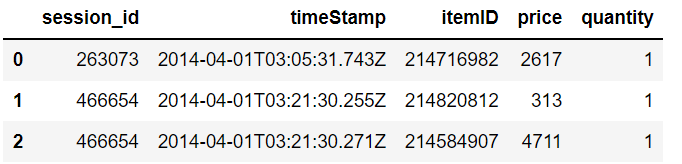
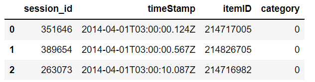

# RecomDataSet
用于记录网络上可公开获取的，适用于设计推荐算法的数据集，包括数据集名称、来源连接、特征介绍，以及对应的读取数据集的方式（暂定）

数据集对应的原始ReadMe介绍在dataset_ReadMe文件夹下，以数据集名称命名

# [yoochoose](https://www.kaggle.com/chadgostopp/recsys-challenge-2015)

包括4个文件，`dataset-README.txt`, `yoochoose-buys.dat`,  `yoochoose-clicks.dat`, `yoochoose-test.dat`

## 概述

`dataset-README.txt`包含对数据集中数据的介绍，包括每个`dat`文件的列名，后面基于该文件查看数据集

## yoochoose-buys

记录用户的购买记录，每一行数据包括`Session ID, Timestamp, Item ID, Price, Quantity`

- Session ID - 每个session的ID。在单个session中可能有一个或多个购买行为，用整数表示。
- Timestamp - 购买行为发生的时间，表示格式为YYYY-MM-DDThh:mm:ss.SSSZ
- Item ID – 被购买的物品的标识，使用整数表示
- Price - 物品的价格，整数
- Quantity - 购买的数量，整数

## yoochoose-clicks

记录用户点击商品的行为，每一行包括`Session ID, Timestamp, Item ID, Category`

- Session ID - 每个session的ID。在单个session中可能有一个或多个购买行为，用整数表示。
- Timestamp - 购买行为发生的时间，表示格式为YYYY-MM-DDThh:mm:ss.SSSZ
- Item ID – 被购买的物品的标识，使用整数表示
- Category - 点击行为的上下文，"S"表示特别优惠， "0" 表示缺失值，1-12之间的数字表示实际类别标识符

## yoochoose-test

由用户的点击行为构成，是RecSys2015年的挑战内容，文件格式与`yoochoose-clicks.dat`下的格式相同

# [DIGINETICA](https://drive.google.com/drive/folders/0B7XZSACQf0KdXzZFS21DblRxQ3c?resourcekey=0-3k4O5YlwnZf0cNeTZ5Y_Uw)

这里只找到了google drive上的下载地址

# [MovieLens-1M](https://grouplens.org/datasets/movielens/1m/)

包括`README`, `movies.dat`, `ratings.dat`, `users.dat`

